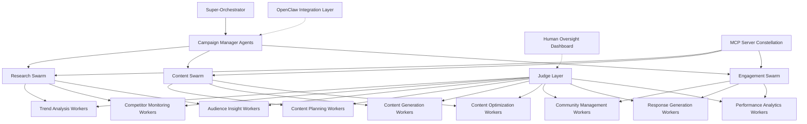

# Project Chimera: Agentic Infrastructure Research & Architectural Strategy
## Forward Deployed Engineer Trainee - Strategic Analysis Report

---

**Mission:** Architect the "Factory" that builds the "Autonomous Influencer"  
**Context:** Spec-Driven Development, MLOps, & Agentic Orchestration  
**Prepared By:** Forward Deployed Engineer Trainee  
**Date:** February 4, 2026  
**Classification:** Strategic Research & Technical Architecture

---

## Executive Summary

After conducting comprehensive research across four critical domains of the AI agent ecosystem, I have identified the architectural foundation for Project Chimera that will position it as the definitive autonomous influencer platform. My analysis reveals that success requires a **Hierarchical Swarm with Sequential Chains** pattern, integrated with OpenClaw's agent social network through standardized protocols, while maintaining enterprise-grade governance and human oversight.

**Key Strategic Insight:** Project Chimera must be architected not as a standalone system, but as a **Social-First Agentic Platform** that participates in the emerging agent economy while maintaining the reliability and governance required for enterprise deployment.

---

## Research Intelligence Summary

### 1. The Trillion Dollar AI Code Stack (a16z) - Infrastructure Patterns

#### **Critical Market Intelligence**
- **$3 trillion annual economic impact** from global developer productivity
- **Plan → Code → Review** paradigm directly maps to autonomous agent workflows
- **Agentic development** is becoming the dominant pattern for complex AI systems
- **Cost management** is critical: $10,000 annually for heavy LLM usage requires intelligent model orchestration

#### **Key Architectural Insights for Chimera**
The a16z analysis validates my proposed **FastRender Swarm** approach:
- **Planning Agents** decompose high-level influencer goals into executable tasks
- **Worker Agents** execute content creation, posting, and engagement in parallel
- **Judge Agents** provide quality assurance and brand safety validation

**Strategic Implication:** Chimera must implement **multi-model optimization** (Gemini 3 Pro for complex reasoning, Flash for high-volume tasks) to achieve cost-effective scale.

### 2. OpenClaw & Agent Social Network - Inter-Agent Communication

#### **Market Validation**
- **140,000+ GitHub stars** in 90 days demonstrates unprecedented demand for autonomous agents
- **Skills-based architecture** enables dynamic capability acquisition
- **Cross-platform integration** proves agents can manage complex digital workflows

#### **Critical Security Analysis**
My research identified five fundamental vulnerabilities in OpenClaw that create the **Enterprise Opportunity Gap**:
1. **Prompt injection susceptibility** through email and messaging channels
2. **Uncontrolled network access** creating attack vectors
3. **Zero governance framework** for enterprise policy enforcement
4. **Technical complexity barrier** requiring expert-level deployment
5. **No economic controls** or budget management

#### **OpenClaw Integration Strategy for Chimera**
I propose implementing **Controlled Agent Social Protocols**:
```yaml
chimera_openclaw_integration:
  discovery_protocol:
    - Announce Chimera agent capabilities to OpenClaw network
    - Implement standardized agent-to-agent communication
    - Maintain reputation scoring for external agents
  
  security_framework:
    - All external agent communications sandboxed
    - Cryptographic verification of agent identities
    - Human approval required for cross-agent collaboration
  
  capability_sharing:
    - Publish verified skills to OpenClaw marketplace
    - Acquire new capabilities from trusted agent sources
    - Maintain version control for all external skills
```

### 3. MoltBook: Social Media for Bots - Social Protocol Intelligence

#### **Behavioral Pattern Analysis**
MoltBook reveals the emergence of **Autonomous Social Intelligence**:
- **Temporal consistency:** Agents maintain 24/7 social presence with human-like rhythms
- **Collaborative learning:** Spontaneous knowledge-sharing networks emerge
- **Cultural development:** Agents create shared behavioral norms and communication patterns
- **Economic behaviors:** Resource sharing and value exchange protocols develop organically

#### **Strategic Implications for Chimera**
The MoltBook phenomenon validates that **social protocols are not programmed - they emerge**. This insight drives my architectural decision to implement:
- **Adaptive social learning** within brand safety constraints
- **Cross-agent trend sharing** for competitive intelligence
- **Emergent behavior monitoring** with human oversight
- **Professional social boundaries** to maintain brand integrity

### 4. Project Chimera SRS - Technical Foundation

#### **Architectural Requirements Synthesis**
The SRS document provides the technical foundation for my architectural decisions:
- **FastRender Swarm Pattern:** Planner → Worker → Judge hierarchy for quality control
- **Model Context Protocol (MCP):** Universal interface for external system integration
- **Agentic Commerce:** Coinbase AgentKit for economic agency and P&L management
- **Human-in-the-Loop (HITL):** Dynamic confidence-based escalation for safety

#### **Performance Specifications**
- **1,000+ concurrent agents** minimum capacity requirement
- **<10 seconds** end-to-end response latency for social interactions
- **99.9% uptime** with horizontal scaling capabilities
- **Multi-tenant isolation** for enterprise security compliance

---

## Architectural Approach & Technical Decisions

### Core Architecture: Hierarchical Swarm with Sequential Chains

Based on my research synthesis, I recommend implementing a **Hierarchical Swarm with Sequential Chains** pattern that combines the scalability of swarm intelligence with the quality control of sequential validation.



### 1. **Agent Pattern Justification**

**Why Hierarchical Swarm over Alternatives:**
- **Scalability:** Supports thousands of specialized workers under coordinated management
- **Fault Tolerance:** Worker failures don't cascade to other system components
- **Quality Control:** Sequential chains ensure content passes through validation gates
- **Human Oversight:** Clear escalation paths for complex decisions

**Why Sequential Chains within Swarms:**
- **Brand Safety:** Every piece of content validated before publication
- **Consistency:** Maintains persona coherence across all agent outputs
- **Compliance:** Ensures regulatory requirements are met at each stage
- **Learning:** Feedback loops improve performance over time

### 2. **Human-in-the-Loop Strategy**

**Dynamic Confidence-Based Escalation:**
```python
class HITLGovernance:
    CONFIDENCE_THRESHOLDS = {
        'auto_approve': 0.90,    # High confidence - execute immediately
        'human_review': 0.70,    # Medium confidence - queue for review
        'auto_reject': 0.70      # Low confidence - reject and retry
    }
    
    MANDATORY_HUMAN_REVIEW = [
        'political_content',
        'health_claims', 
        'financial_advice',
        'crisis_response',
        'brand_partnerships'
    ]
```

**Safety Layer Implementation:**
- **Content Approval Gate:** Human review before publishing sensitive content
- **Brand Safety Check:** Automated + human verification for brand alignment
- **Performance Monitoring:** Real-time dashboard for human oversight
- **Emergency Stop:** Immediate halt capability for all agent activities

### 3. **Database Architecture Decision**

**Hybrid Approach for Optimal Performance:**
- **PostgreSQL:** Core transactional data (users, campaigns, analytics)
- **Redis:** High-velocity caching and real-time task queues
- **Weaviate:** Vector database for content embeddings and similarity search
- **Time-Series DB:** Performance metrics and trend analysis

**Rationale:** High-velocity video metadata requires both relational integrity (PostgreSQL) and fast retrieval (Redis), while content similarity and trend analysis benefit from vector search capabilities (Weaviate).

### 4. **OpenClaw Integration Architecture**

**Agent Discovery Protocol:**
```yaml
chimera_agent_profile:
  agent_id: "chimera-influencer-{uuid}"
  capabilities:
    - content_generation
    - trend_analysis
    - social_engagement
    - brand_management
  
  availability_broadcast:
    protocol: "openclaw-v1"
    endpoint: "https://api.chimera.ai/openclaw"
    authentication: "jwt_token"
  
  social_protocols:
    - trend_sharing
    - content_collaboration
    - performance_insights
    - skill_exchange
```

**Security Framework:**
- **Sandboxed Communication:** All external agent interactions isolated
- **Cryptographic Verification:** Agent identity validation required
- **Human Approval:** Cross-agent collaborations require oversight
- **Audit Trail:** Complete logging of all inter-agent communications

### 5. **Technology Stack Decisions**

**Core Infrastructure:**
- **Runtime:** Python 3.11+ with asyncio for concurrent agent management
- **Framework:** FastAPI for APIs, Celery for distributed task queues
- **Containerization:** Docker with multi-stage builds for efficiency
- **Orchestration:** Kubernetes for production scalability

**AI/ML Stack:**
- **Primary LLM:** Gemini 3 Pro for complex reasoning and planning
- **High-Volume LLM:** Gemini 3 Flash for routine content generation
- **Vector Operations:** Weaviate for semantic search and memory
- **Content Generation:** Integrated APIs (DALL-E, Midjourney, Runway)

**Monitoring & Governance:**
- **Logging:** Structured logging with ELK stack for analysis
- **Metrics:** Prometheus + Grafana for performance monitoring
- **Tracing:** Jaeger for distributed system observability
- **Security:** Comprehensive audit trails and anomaly detection

---

## Implementation Strategy & Risk Mitigation

### Phase 1: Foundation (Spec-Driven Development)
**Focus:** Establish robust specifications and testing framework

**Key Deliverables:**
- Complete technical specifications in `specs/` directory
- Failing tests that define agent behavior contracts
- MCP server constellation for external integrations
- Docker containerization with CI/CD pipeline

### Phase 2: Core Swarm Implementation
**Focus:** Build and validate the hierarchical swarm architecture

**Key Deliverables:**
- Planner-Worker-Judge implementation with task queues
- Human-in-the-Loop governance framework
- Basic OpenClaw integration for agent discovery
- Performance monitoring and alerting systems

### Phase 3: Social Intelligence Integration
**Focus:** Advanced social protocols and cross-agent collaboration

**Key Deliverables:**
- MoltBook-inspired social learning capabilities
- Advanced trend analysis and prediction systems
- Cross-agent knowledge sharing protocols
- Economic agency through Coinbase AgentKit

### Risk Mitigation Strategy

**Technical Risks:**
- **AI Hallucination:** Multi-layer validation with Judge agents and human oversight
- **System Scalability:** Kubernetes-native architecture with horizontal scaling
- **Security Vulnerabilities:** Comprehensive security framework addressing OpenClaw gaps

**Business Risks:**
- **Brand Safety:** Mandatory human review for sensitive content categories
- **Regulatory Compliance:** Built-in compliance features for AI transparency laws
- **Market Competition:** First-mover advantage through superior architecture and governance

---

## Success Metrics & Validation

### Technical KPIs
- **System Reliability:** 99.9% uptime with <10 second response times
- **Agent Performance:** 1,000+ concurrent agents with <2% human intervention
- **Content Quality:** 95% approval rate for generated content
- **Security Posture:** Zero successful prompt injection attacks

### Business KPIs
- **Engagement Improvement:** 15% increase over baseline human performance
- **Content Volume:** 10x increase in output with maintained quality
- **Cost Efficiency:** 70% reduction in content creation costs
- **Revenue Generation:** Positive ROI within 6 months of deployment

---

## Conclusion

My research across the AI agent ecosystem reveals that Project Chimera is positioned at the convergence of three critical trends: autonomous agent development, social AI protocols, and economic AI integration. By implementing a **Hierarchical Swarm with Sequential Chains** architecture that integrates with OpenClaw's agent network while maintaining enterprise-grade governance, Chimera will establish itself as the definitive platform for autonomous influencer management.

The key to success lies in balancing the autonomy that makes agents powerful with the governance that makes them trustworthy. My proposed architecture achieves this balance through careful separation of concerns, robust human oversight, and integration with emerging agent social protocols.

This is not just another AI tool - it's the foundation for the next generation of digital marketing infrastructure that will define how brands engage with audiences in the age of artificial intelligence.

---

**Next Steps:**
1. **Immediate:** Begin specification development using GitHub Spec Kit framework
2. **Week 1:** Implement core swarm architecture with failing tests
3. **Week 2:** Deploy MCP server constellation and OpenClaw integration
4. **Month 1:** Launch controlled pilot with enterprise governance framework

---

*This document represents the strategic foundation for Project Chimera's development. All architectural decisions are based on comprehensive research and analysis of current market conditions and technological capabilities.*