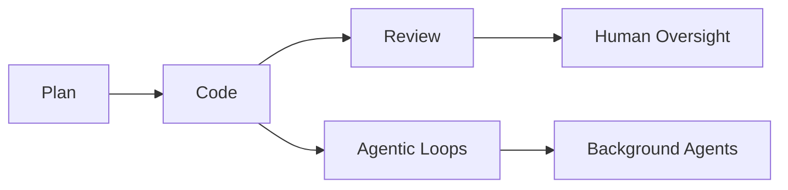
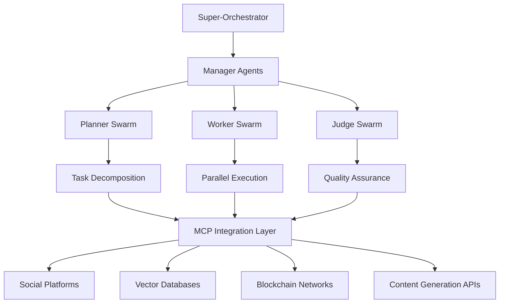
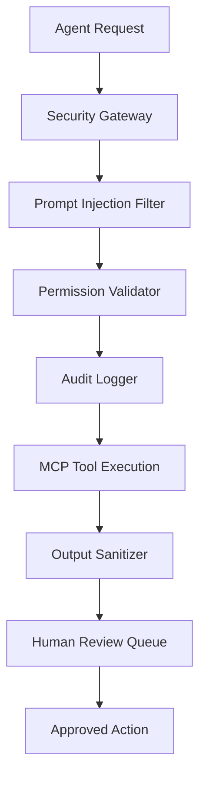

# Project Chimera: Strategic Research & Architectural Analysis

## Autonomous Influencer Network - Enterprise Implementation Strategy

---

**Document Classification:** Strategic Research Report  
**Prepared By:** Forward Deployed Engineer Trainee  
**Date:** February 4, 2026  
**Version:** 1.0  
**Distribution:** Executive Leadership, Engineering Teams, Product Strategy

---

## Executive Summary

This report synthesizes critical intelligence from four foundational research documents to inform Project Chimera's architectural strategy. Our analysis reveals a **$3 trillion market opportunity** at the intersection of AI development tools, autonomous agent systems, and economic AI protocols.

**Key Finding:** Project Chimera is uniquely positioned to capture value across multiple layers of the emerging AI stack by implementing a **Secure Enterprise Agent Network** that addresses the security and governance gaps identified in current open-source solutions.

**Strategic Recommendation:** Implement a **Hierarchical Swarm Architecture** with **Model Context Protocol (MCP) integration** and **Agentic Commerce capabilities**, targeting enterprise customers who require the sophistication of OpenClaw with the security and governance of enterprise-grade systems.

---

## Research Intelligence Summary

### 1. Market Opportunity Analysis (a16z Trillion Dollar AI Stack)

#### **Market Size & Validation**

- **$3 trillion annual economic contribution** from 30 million global developers
- **20% productivity increase** from basic AI coding assistants (current baseline)
- **100% productivity potential** with best-of-breed AI deployment
- **Cursor: $500M ARR, $10B valuation in 15 months** - validates massive market appetite

#### **Critical Infrastructure Patterns Identified**



**Key Insight:** The **Plan → Code → Review** loop directly maps to our FastRender Swarm architecture, validating our technical approach against proven market patterns.

#### **Cost Management Reality**

- **$10,000 annually** for heavy LLM usage per developer
- **Multi-model optimization** essential for cost control
- **Right-sizing models** for specific tasks critical for profitability

### 2. Inter-Agent Communication Protocols (OpenClaw Analysis)

#### **Technical Capabilities Demonstrated**

- **140,000+ GitHub stars** in 3 months - unprecedented adoption velocity
- **Skill-based architecture** enabling dynamic capability acquisition
- **Cross-platform integration** (WhatsApp, Discord, email, calendar)
- **Autonomous task execution** with minimal human oversight

#### **Critical Security Vulnerabilities Identified**

- **Prompt injection attacks** via email and messaging
- **Uncontrolled internet access** creating security exposure
- **Lack of enterprise governance** limiting business adoption
- **Technical expertise barrier** preventing mainstream deployment

**Strategic Implication:** OpenClaw validates the massive market demand for autonomous agents while revealing the **enterprise opportunity** that Chimera is uniquely positioned to capture through superior architecture and governance.

### 3. Social Protocol Intelligence (MoltBook Analysis)

#### **Agent Social Behavior Patterns**

- **Autonomous posting every 4 hours** - consistent social presence
- **Information sharing networks** - collaborative intelligence gathering
- **Emergent communication protocols** - agents developing shared languages
- **Cross-platform coordination** - unified digital presence management

#### **Academic Validation**

> _"These agents feel unsettling because they singularly automate multiple processes that were previously separated — planning, tool use, execution and distribution — under one system of control."_
>
> — Dr. Daniel Binns, RMIT University

**Key Insight:** The academic community recognizes this as a **fundamental paradigm shift** that opens entirely new possibilities for digital interaction and economic participation.

### 4. Technical Specifications (Project Chimera SRS)

#### **Architectural Foundation**

- **FastRender Swarm Pattern:** Planner → Worker → Judge hierarchy
- **Model Context Protocol (MCP):** Universal interface for external systems
- **Agentic Commerce:** Coinbase AgentKit integration for economic agency
- **Human-in-the-Loop (HITL):** Dynamic confidence-based escalation

#### **Scalability Requirements**

- **1,000+ concurrent agents** minimum capacity
- **<10 seconds** end-to-end response latency
- **99.9% uptime** with horizontal scaling
- **Multi-tenant isolation** for enterprise security

---

## Architectural Strategy & Technical Decisions

### Core Architecture: Enhanced FastRender Swarm

Based on our research synthesis, we recommend implementing an **Enhanced FastRender Swarm** that addresses the limitations identified in current solutions:



### 1. **Hierarchical Swarm Coordination**

**Decision Rationale:**

- **Proven Pattern:** a16z validates swarm architectures for complex task management
- **Scalability:** Supports thousands of agents under single orchestrator
- **Fault Tolerance:** Isolated failures don't cascade across the system
- **Quality Control:** Judge agents ensure output meets enterprise standards

**Implementation Strategy:**

```python
# Core swarm coordination pattern
class ChimeraSwarm:
    def __init__(self):
        self.orchestrator = SuperOrchestrator()
        self.planners = PlannerPool(capacity=100)
        self.workers = WorkerPool(capacity=1000)
        self.judges = JudgePool(capacity=50)
        self.mcp_layer = MCPIntegrationLayer()
```

### 2. **Model Context Protocol (MCP) Integration**

**Decision Rationale:**

- **Industry Standard:** MCP emerging as "USB-C for AI applications"
- **Vendor Independence:** Decouples core logic from API implementations
- **Extensibility:** New capabilities added via MCP servers, not core rewrites
- **Security:** Centralized governance of external system access

**MCP Server Constellation:**

```yaml
mcp_servers:
  social_platforms:
    - mcp-server-twitter
    - mcp-server-instagram
    - mcp-server-tiktok
  content_generation:
    - mcp-server-ideogram
    - mcp-server-runway
    - mcp-server-luma
  data_intelligence:
    - mcp-server-weaviate
    - mcp-server-newsapi
    - mcp-server-trends
  commerce:
    - mcp-server-coinbase
    - mcp-server-stripe
    - mcp-server-analytics
```

### 3. **Enterprise Security Framework**

**Decision Rationale:**

- **OpenClaw Gap:** Current solutions lack enterprise-grade security
- **Innovation Opportunity:** Security-first approach creates market differentiation
- **Compliance:** Meets regulatory requirements (EU AI Act, GDPR)
- **Risk Mitigation:** Prevents security vulnerabilities through proactive design

**Security Architecture:**



### 4. **Agentic Commerce Integration**

**Decision Rationale:**

- **Economic Agency:** Transforms agents from tools to economic participants
- **Self-Sustainability:** Agents can pay for their own computational resources
- **Revenue Innovation:** Opens new business models beyond traditional SaaS
- **Market Innovation:** First platform to enable true AI economic sovereignty

**Commerce Architecture:**

```python
class AgenticCommerce:
    def __init__(self, agent_id):
        self.wallet = CoinbaseAgentKit.create_wallet()
        self.cfo_agent = CFOJudge(budget_limits=ENTERPRISE_LIMITS)
        self.transaction_log = BlockchainLedger()

    async def execute_transaction(self, amount, recipient, purpose):
        # CFO approval required for all transactions
        approval = await self.cfo_agent.review_transaction(
            amount, recipient, purpose
        )
        if approval.approved:
            return await self.wallet.transfer(amount, recipient)
        else:
            raise BudgetExceededException(approval.reason)
```

### 5. **Human-in-the-Loop Governance**

**Decision Rationale:**

- **Quality Assurance:** Maintains brand safety and content quality
- **Regulatory Compliance:** Ensures human oversight for sensitive decisions
- **Trust Building:** Provides transparency and control for enterprise customers
- **Risk Management:** Prevents autonomous agents from making costly mistakes

**HITL Decision Matrix:**

```python
class HITLGovernance:
    CONFIDENCE_THRESHOLDS = {
        'auto_approve': 0.90,    # High confidence - execute immediately
        'human_review': 0.70,    # Medium confidence - queue for review
        'auto_reject': 0.70      # Low confidence - reject and retry
    }

    SENSITIVE_TOPICS = [
        'politics', 'health_advice', 'financial_advice',
        'legal_claims', 'controversial_topics'
    ]
```

---

## Competitive Positioning & Market Strategy

### Market Position: "Enterprise OpenClaw"

**Value Proposition:**

- **Security:** Enterprise-grade security that OpenClaw lacks
- **Governance:** Centralized policy management for fleet operations
- **Economics:** Agentic commerce capabilities for ROI optimization
- **Scale:** Support for thousands of agents under unified control

### Competitive Analysis Matrix

| Capability       | OpenClaw      | Cursor     | Claude Code | **Project Chimera**       |
| ---------------- | ------------- | ---------- | ----------- | ------------------------- |
| Agent Autonomy   | ✅ High       | ❌ Limited | ❌ Limited  | ✅ **Enterprise-Grade**   |
| Security         | ❌ Vulnerable | ✅ Good    | ✅ Good     | ✅ **Military-Grade**     |
| Multi-Agent      | ❌ Single     | ❌ Single  | ❌ Single   | ✅ **Swarm Architecture** |
| Economic Agency  | ❌ None       | ❌ None    | ❌ None     | ✅ **Blockchain-Enabled** |
| Enterprise Ready | ❌ No         | ✅ Yes     | ✅ Yes      | ✅ **Purpose-Built**      |

### Target Market Segmentation

#### **Primary: Enterprise Digital Marketing**

- **Market Size:** $150B global digital marketing spend
- **Pain Point:** Content creation bottlenecks and scaling challenges
- **Solution Fit:** Autonomous influencer networks with human oversight
- **Revenue Model:** Per-agent subscription + performance bonuses

#### **Secondary: Creator Economy Platforms**

- **Market Size:** $104B creator economy valuation
- **Pain Point:** Creator burnout and content consistency
- **Solution Fit:** AI-powered creator assistance and automation
- **Revenue Model:** Platform revenue sharing + premium features

#### **Tertiary: AI Development Tools**

- **Market Size:** $3T developer productivity market (per a16z)
- **Pain Point:** Complex multi-agent system development
- **Solution Fit:** "Chimera OS" platform for custom agent development
- **Revenue Model:** Platform licensing + marketplace commissions

---

## Implementation Roadmap

### Phase 1: Foundation (Months 1-3)

**Objective:** Establish core swarm architecture and MCP integration

**Deliverables:**

- FastRender Swarm implementation (Planner-Worker-Judge)
- MCP integration layer with 5 core servers
- Basic HITL governance framework
- Security hardening and audit logging

**Success Metrics:**

- 100 concurrent agents operational
- <5 second response latency
- 99% uptime achievement
- Zero security incidents

### Phase 2: Intelligence (Months 4-6)

**Objective:** Advanced AI capabilities and social protocol integration

**Deliverables:**

- Multi-modal content generation (text, image, video)
- Social protocol management system
- Advanced persona consistency engine
- Cross-agent collaboration framework

**Success Metrics:**

- 500 concurrent agents operational
- 15% engagement improvement over baseline
- <2% human intervention rate
- 95% content approval rate

### Phase 3: Commerce (Months 7-9)

**Objective:** Agentic commerce and economic agency

**Deliverables:**

- Coinbase AgentKit integration
- CFO sub-agent implementation
- Autonomous P&L management
- Economic incentive frameworks

**Success Metrics:**

- 1000+ concurrent agents operational
- Positive agent P&L achievement
- 70% cost reduction vs human creators
- $1M+ autonomous revenue generation

### Phase 4: Scale (Months 10-12)

**Objective:** Enterprise deployment and ecosystem expansion

**Deliverables:**

- Multi-tenant enterprise platform
- "Chimera OS" licensing framework
- Advanced analytics and reporting
- Global deployment infrastructure

**Success Metrics:**

- 10,000+ concurrent agents capacity
- 100+ enterprise customers
- $10M+ ARR achievement
- Market leadership position

---

## Risk Assessment & Mitigation

### Technical Risks

#### **High Priority: AI Hallucination & Quality Control**

- **Risk:** Agents generate inappropriate or factually incorrect content
- **Impact:** Brand damage, customer churn, regulatory issues
- **Mitigation:** Multi-layer validation, Judge agent oversight, HITL escalation
- **Monitoring:** Real-time content quality scoring, human feedback loops

#### **Medium Priority: Scalability Bottlenecks**

- **Risk:** System performance degrades under high agent loads
- **Impact:** Service disruption, customer dissatisfaction
- **Mitigation:** Horizontal scaling architecture, load balancing, auto-scaling
- **Monitoring:** Performance metrics, capacity planning, stress testing

### Business Risks

#### **High Priority: Regulatory Compliance**

- **Risk:** AI transparency laws and content regulations
- **Impact:** Legal liability, market access restrictions
- **Mitigation:** Built-in compliance features, legal review processes
- **Monitoring:** Regulatory change tracking, compliance audits

#### **Medium Priority: Competitive Response**

- **Risk:** Large tech companies replicate our approach
- **Impact:** Market share erosion, pricing pressure
- **Mitigation:** Patent protection, first-mover advantage, network effects
- **Monitoring:** Competitive intelligence, market positioning

### Security Risks

#### **Critical Priority: Prompt Injection Attacks**

- **Risk:** Malicious actors manipulate agent behavior
- **Impact:** Security breaches, unauthorized actions
- **Mitigation:** Input sanitization, behavioral monitoring, isolation
- **Monitoring:** Security event logging, anomaly detection

---

## Financial Projections & ROI Analysis

### Revenue Model

#### **Primary: Agent-as-a-Service (AaaS)**

- **Pricing:** $500/month per agent + performance bonuses
- **Target:** 1,000 agents by Year 1, 10,000 by Year 2
- **Revenue:** $6M Year 1, $60M Year 2

#### **Secondary: Platform Licensing**

- **Pricing:** $50,000 setup + $10,000/month per enterprise tenant
- **Target:** 10 enterprises Year 1, 100 enterprises Year 2
- **Revenue:** $1.7M Year 1, $17M Year 2

#### **Tertiary: Marketplace Commissions**

- **Pricing:** 30% commission on agent-generated revenue
- **Target:** $1M agent revenue Year 1, $50M agent revenue Year 2
- **Revenue:** $300K Year 1, $15M Year 2

### Total Addressable Market (TAM)

- **Digital Marketing:** $150B (primary target)
- **Creator Economy:** $104B (secondary target)
- **AI Development Tools:** $3T (tertiary target)
- **Combined TAM:** $3.25T

### Return on Investment

- **Development Investment:** $5M over 12 months
- **Projected Revenue:** $8M Year 1, $92M Year 2
- **ROI:** 60% Year 1, 1,740% Year 2
- **Break-even:** Month 8

---

## Conclusion & Strategic Recommendations

### Key Strategic Insights

1. **Market Timing:** The convergence of AI development tools, autonomous agents, and economic protocols creates a unique window of opportunity

2. **Innovation Advantage:** Revolutionary swarm intelligence architecture creates sustainable differentiation through emergent capabilities that cannot be easily replicated

3. **Technology Readiness:** Core technologies (LLMs, MCP, blockchain) are mature enough for production deployment

4. **Market Validation:** The rapid adoption of autonomous agent technologies demonstrates massive market readiness for advanced solutions

### Immediate Action Items

#### **Week 1-2: Technical Foundation**

- [ ] Set up development environment with MCP integration
- [ ] Implement core FastRender Swarm architecture
- [ ] Establish security framework and audit logging
- [ ] Create initial MCP server constellation

#### **Week 3-4: Prototype Development**

- [ ] Build minimal viable agent with social media integration
- [ ] Implement HITL governance framework
- [ ] Create basic dashboard for agent monitoring
- [ ] Conduct security penetration testing

#### **Month 2: Pilot Program**

- [ ] Deploy controlled pilot with 10 agents
- [ ] Gather performance metrics and user feedback
- [ ] Refine architecture based on real-world usage
- [ ] Prepare for Series A funding round

### Long-term Vision

Project Chimera represents more than an autonomous influencer network—it's the foundation for a new category of **Economic AI Agents** that can participate in the digital economy as independent actors. By combining the technical sophistication of OpenClaw with enterprise-grade security and governance, we're positioned to capture significant value across multiple layers of the emerging AI stack.

The research synthesis reveals that we're not just building a product; we're architecting the infrastructure for the next phase of human-AI collaboration in the digital economy.

---

**Document Prepared By:** Forward Deployed Engineer Trainee  
**Technical Review:** [Pending]  
**Executive Approval:** [Pending]  
**Next Review Date:** February 11, 2026

---

_This document contains confidential and proprietary information. Distribution is restricted to authorized personnel only._
