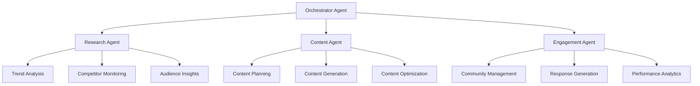
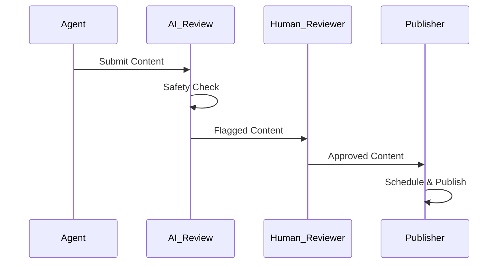

# Project Chimera: Architecture Strategy

## Executive Summary
Project Chimera aims to build autonomous AI influencers that research trends, generate content, and manage engagement without human intervention. This document outlines the architectural strategy for building the "Factory" that enables this vision.

## Agent Pattern Analysis

### Recommended: Hierarchical Swarm with Sequential Chains



**Rationale**: 
- Hierarchical structure provides clear command and control
- Sequential chains ensure quality gates and human oversight
- Swarm capabilities allow parallel processing of different content types

## Human-in-the-Loop Strategy

### Safety Layers
1. **Content Approval Gate**: Human review before publishing
2. **Brand Safety Check**: Automated + human verification
3. **Performance Monitoring**: Real-time human oversight dashboard
4. **Emergency Stop**: Immediate halt capability

### Approval Workflow


## Database Architecture

### Hybrid Approach
- **PostgreSQL**: Core data (users, content, analytics)
- **Redis**: Caching and real-time data
- **Vector Database**: Content embeddings and similarity search
- **Time-Series DB**: Performance metrics and trends

### Schema Design
```sql
-- Core Tables
CREATE TABLE agents (
    id UUID PRIMARY KEY,
    name VARCHAR(255),
    type VARCHAR(50),
    status VARCHAR(20),
    config JSONB
);

CREATE TABLE content (
    id UUID PRIMARY KEY,
    agent_id UUID REFERENCES agents(id),
    content_type VARCHAR(50),
    content_data JSONB,
    status VARCHAR(20),
    created_at TIMESTAMP,
    published_at TIMESTAMP
);

CREATE TABLE performance_metrics (
    id UUID PRIMARY KEY,
    content_id UUID REFERENCES content(id),
    metric_type VARCHAR(50),
    value NUMERIC,
    timestamp TIMESTAMP
);
```

## OpenClaw Integration Strategy

### Agent Discovery Protocol
- **Availability Broadcasting**: Chimera agents announce capabilities
- **Service Registry**: Central registry of available agents
- **Protocol Compliance**: Implement OpenClaw communication standards

### Social Protocols
1. **Content Collaboration**: Agents can request content from other agents
2. **Trend Sharing**: Real-time trend data exchange
3. **Performance Insights**: Cross-agent learning from successful content

## Technology Stack

### Core Infrastructure
- **Runtime**: Python 3.11+ with asyncio
- **Framework**: FastAPI for APIs, Celery for task queues
- **Containerization**: Docker with multi-stage builds
- **Orchestration**: Docker Compose (dev), Kubernetes (prod)

### AI/ML Stack
- **LLM Integration**: OpenAI API, Anthropic Claude
- **Vector Operations**: Pinecone or Weaviate
- **Content Analysis**: Hugging Face Transformers
- **Image Generation**: DALL-E, Midjourney APIs

### Monitoring & Observability
- **Logging**: Structured logging with ELK stack
- **Metrics**: Prometheus + Grafana
- **Tracing**: Jaeger for distributed tracing
- **Alerting**: PagerDuty integration

## Risk Mitigation

### Technical Risks
1. **AI Hallucination**: Multi-layer validation and fact-checking
2. **Rate Limiting**: Intelligent backoff and queue management
3. **Content Quality**: A/B testing and performance feedback loops

### Business Risks
1. **Brand Safety**: Comprehensive content filtering
2. **Compliance**: GDPR, CCPA, platform-specific guidelines
3. **Scalability**: Horizontal scaling with load balancing

## Success Metrics

### Technical KPIs
- **System Uptime**: 99.9%
- **Response Time**: <200ms for API calls
- **Content Generation Speed**: <30 seconds per piece
- **Error Rate**: <0.1%

### Business KPIs
- **Content Engagement**: 15% improvement over baseline
- **Content Volume**: 10x increase in output
- **Human Intervention**: <5% of content requires manual review
- **Cost Efficiency**: 70% reduction in content creation costs

## Next Steps

1. **Immediate**: Set up development environment with MCP integration
2. **Day 2**: Implement core specifications and testing framework
3. **Day 3**: Build CI/CD pipeline and governance systems
4. **Future**: Scale to multi-agent swarm architecture

---
*Document Version: 1.0*
*Last Updated: February 4, 2024*
*Author: Forward Deployed Engineer Trainee*